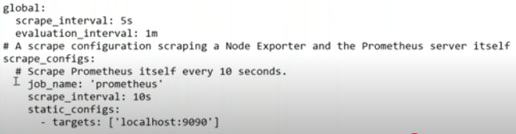

# setup prometheus-ubuntu

step1- Configure prometheus

# create a user for prometheus on my system
```sh
$ useradd -rs/bin/false prometheus
```

# create a new folder and a new configuration file for prometheus

```sh
mkdir /etc/promotheus
touch /etc/prometheus/prometheus.yml
```

# create a data folder for prometheus

```sh
mkdir -p/data/prometheus
chown prometheus: prometheus/data/prometheus/etc/promtheus/*
```

# we will run it on docker

# the yaml file scrape



```sh
cat /etc/passwd | grep prometheus
```
# create prmetheus container

```sh
ddocker run --name myprom -d -p 9090:9090 --user 997:997 --net=host -v /etc/prometheus:/etc/prometheus -v /data/prometheus:/data/prometheus/ prom/prometheus --config.file="/etc/prometheus/prometheus.yml" --storage.tsdb.path="/data/prometheus"
```

```sh
docker ps
docker logs -f myprom
allow port into the security group to access it to the internet
```

# verify prometheus
- access prometheus:<HOST-IP>:9090/graph

# to restart promtetheus, get the PID & send SIGHUP signal

```sh
ps aux | grep prometheus
kill -HUP <PID>
```
