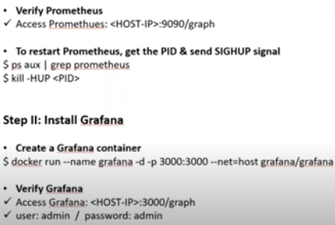

# setup grafana

grafan is a vizual graphic that allow us to see the log parse by prometheus and the alert.



# step 2: install grafana

# create a grafana container
```sh
docker run --name grafana -d -p 3000:3000 --net=host grafana/grafana
```

# verify grafana
- access grafana: <HOST-IP>:3000/graph
- user: admin / password: admin

```sh
docker logs -f grafana

make sure to allow the security group to have to the internet
password: admin
username: admin
```


